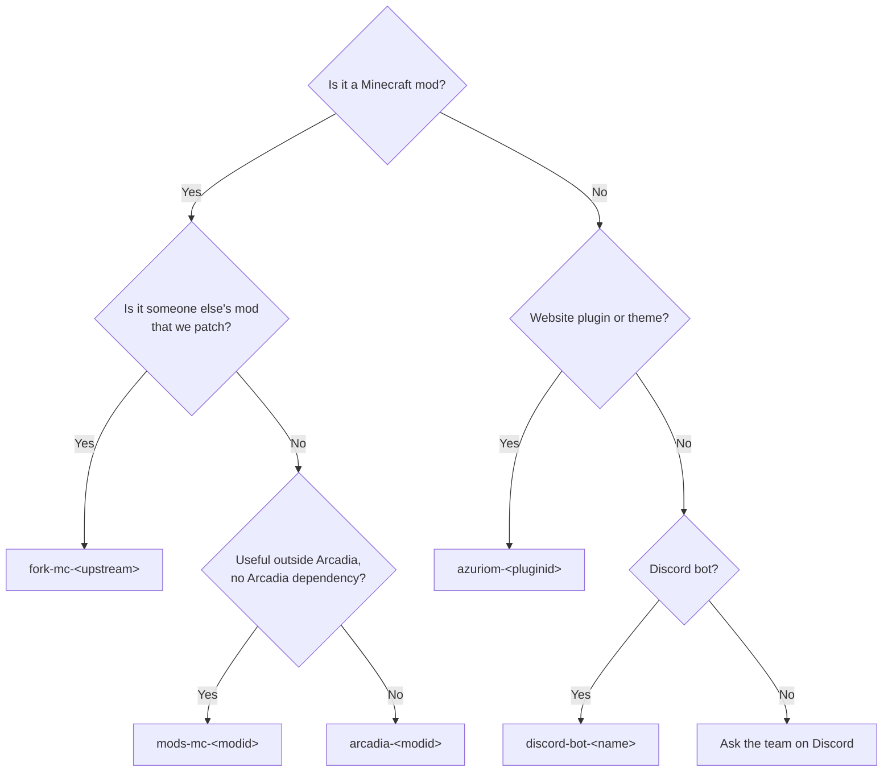
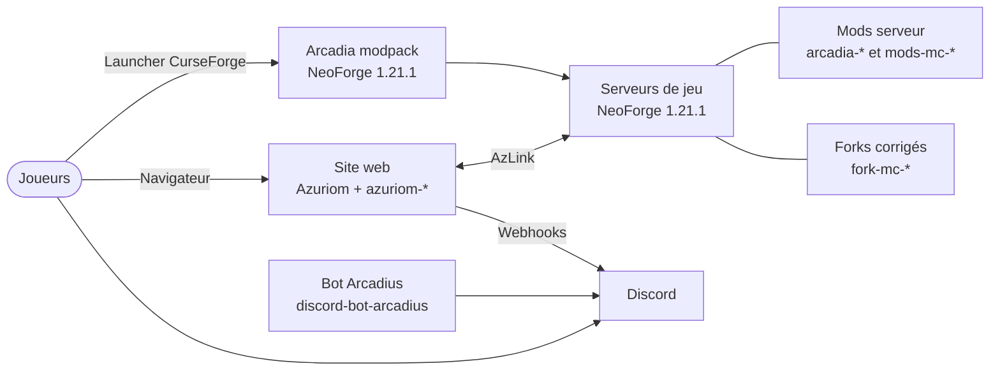
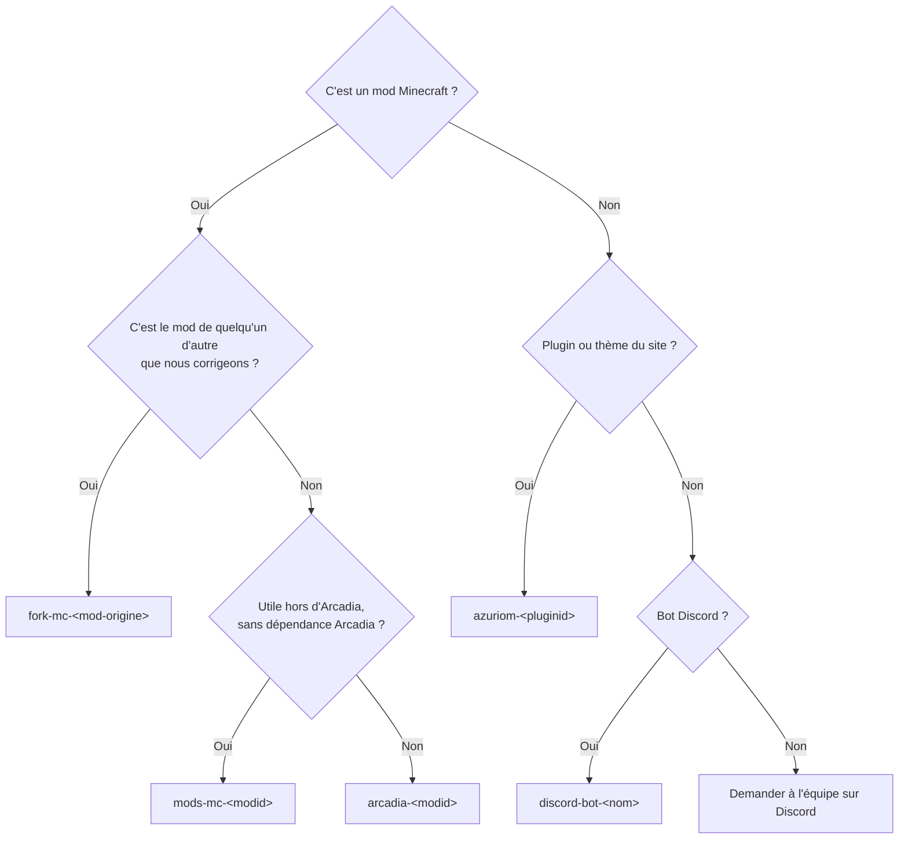

<div align="center">


# Team Arcadia

**The studio behind *Arcadia: Echoes Of Power*, a French modded Minecraft server where magic meets machinery.**

<sub>Create technology · Magic · Player economy · 7 languages · NeoForge 1.21.1</sub>

<br/>

[](https://arcadia-echoes-of-power.fr/discord)
[](https://www.arcadia-echoes-of-power.fr)
[](https://www.arcadia-echoes-of-power.fr/players)

[](#versions-and-compatibility)
[](#versions-and-compatibility)
[](#versions-and-compatibility)
[](https://azuriom.com)
[](https://www.ovhcloud.com/fr/)

**[English](#english)** &nbsp;·&nbsp; **[Français](#francais)**

</div>

---

<a name="english"></a>

## English

### Contents

1. [Who we are](#who-we-are)
2. [Arcadia at a glance](#arcadia-at-a-glance)
3. [How everything fits together](#how-everything-fits-together)
4. [Repository naming convention](#repository-naming-convention)
5. [Repository index](#repository-index)
6. [Find your way](#find-your-way)
7. [Versions and compatibility](#versions-and-compatibility)
8. [Branches](#branches)
9. [Contributing](#contributing)
10. [Security](#security)
11. [Links and contact](#links-and-contact)
12. [License](#license)

---

### Who we are

Team Arcadia builds and runs **Arcadia: Echoes Of Power**, a modded Minecraft community based in France. Everything the
server needs is made here: the modpack players install, the mods that run on the game servers, the patched forks that
keep third-party mods stable, the website and its plugins, and the Discord bot.

This organization is the single home for all of it. This page explains how the repositories are named, what each one
does, and where to start depending on who you are.

### Arcadia at a glance

| | |
|---|---|
| **Modpack** | NeoForge 1.21.1, 440+ mods, 3000+ quests in 31 chapters, translated into 7 languages |
| **Servers** | 5 official servers, 40 to 80 players each, record of 88 players online at once |
| **Signature content** | Cross-mod progression through custom bridge items (Arcane Circuit, Ethereal Alloy, Industrial Heart, Rune Matrix), relic armor and weapons, 20 original music discs |
| **Website** | Azuriom CMS with a custom theme and around forty in-house plugins: wiki, shop, votes, support, roadmap, creators space |
| **Open source here** | 7 Arcadia mods, 4 standalone mods, 9 maintained forks, 1 Discord bot |

### How everything fits together


- **Players** install the modpack and connect to the game servers.
- **Game servers** run the Arcadia mods (gameplay, administration, performance) and our fixed builds of third-party mods.
- **The website** handles accounts, the shop, votes, the wiki and support. It talks to the game servers through
  [AzLink](https://azuriom.com/azlink) (rewards, in-game announcements, teleports) and to Discord through webhooks.
- **Discord** is where the community lives, with Arcadius, our AI-assisted bot, answering questions.

---

### Repository naming convention

Every repository name tells you **what family it belongs to** before you even open it. The pattern is always:

```
<family-prefix>-<name>
```

| Prefix | Family | What goes there | Example |
|---|---|---|---|
| `arcadia-` | **Arcadia projects** | Mods and content built *for* the Arcadia server and modpack. They may depend on each other and are not meant to be used elsewhere. | `arcadia-games` |
| `mods-mc-` | **Standalone Minecraft mods** | Generic mods that work on any server or modpack, published for everyone (CurseForge). No dependency on Arcadia. | `mods-mc-rspolymorph` |
| `fork-mc-` | **Maintained forks** | Third-party mods we patch to fix crashes or incompatibilities in our pack. The name after the prefix is the upstream mod. | `fork-mc-ecologics` |
| `azuriom-` | **Website** | Plugins and the theme of our [Azuriom](https://azuriom.com) website. Themes use `azuriom-theme-<name>`. | `azuriom-<plugin-id>` |
| `discord-bot-` | **Discord bots** | Bots running on the community Discord. | `discord-bot-arcadius` |
| `.github` | **Organization** | This profile page and the default community files of the organization. | `.github` |

**Rules**

1. **Lowercase only**, words separated by hyphens. No spaces, no underscores, no capitals.
2. **The prefix is mandatory.** A repository without a family prefix is a repository nobody can find.
3. **The name says what the project is.** For a mod, the part after the prefix is the mod's name (`arcadia-guard` is
   ArcadiaGuard); for a fork, it is the upstream project name; for an Azuriom plugin, it is the plugin's name.
4. **Description in English**, one sentence, saying what the project does and for which platform.
5. **Topics** always include `team-arcadia`, plus the platform (`neoforge`, `azuriom-plugin`, `minecraft-1-21-1`...).

**Which prefix for a new project?**



> A few older repositories predate the convention (for example `Arcadia-Dungeon`). They will be renamed over time;
> GitHub redirects old links automatically.

---

### Repository index

#### Arcadia mods (`arcadia-`)

<details open>
<summary><b>Gameplay</b></summary>

| Repository | Description |
|---|---|
| [arcadia-games](https://github.com/Team-Arcadia/arcadia-games) | Server-side minigames: 32 competitive games with scoring, leaderboards, configurable rewards. No client install required. |
| [Arcadia-Dungeon](https://github.com/Team-Arcadia/Arcadia-Dungeon) | Configurable dungeons with adaptive bosses, wave phases, rewards and leaderboards. |
| [arcadia-lootbox](https://github.com/Team-Arcadia/arcadia-lootbox) | Data-driven loot boxes with keys, multi-draw and a hub interface. |

</details>

<details open>
<summary><b>Server and administration</b></summary>

| Repository | Description |
|---|---|
| [arcadia-guard](https://github.com/Team-Arcadia/arcadia-guard) | Zone protection with 86 flags, a full in-game interface, LuckPerms integration and 3D zone rendering. |
| [arcadia-spawndimension](https://github.com/Team-Arcadia/arcadia-spawndimension) | Spawn dimension and lobby, random teleport, themed tab list and cross-server tools. |

</details>

<details open>
<summary><b>Performance and patches</b></summary>

| Repository | Description |
|---|---|
| [arcadia-patchcreate](https://github.com/Team-Arcadia/arcadia-patchcreate) | Server-side performance and stability patches for Create, each one toggleable and checked against a bytecode fingerprint. |
| [arcadia-tweaks](https://github.com/Team-Arcadia/arcadia-tweaks) | Modular Mixin-based optimizations for the modpack (BotanyPots, Mekanism...), every patch behind its own toggle. |

</details>

#### Standalone mods (`mods-mc-`)

| Repository | Description |
|---|---|
| [mods-mc-rspolymorph](https://github.com/Team-Arcadia/mods-mc-rspolymorph) | Recipe selection for the Refined Storage crafting and pattern grids, NeoForge and Fabric, no Polymorph needed. On [CurseForge](https://www.curseforge.com/minecraft/mc-mods/rs-polymorph). |
| [mods-mc-creative-admin](https://github.com/Team-Arcadia/mods-mc-creative-admin) | Server-enforced creative mode restrictions: named profiles define what players may take. |
| [mods-mc-customperm](https://github.com/Team-Arcadia/mods-mc-customperm) | Grant vanilla and modded commands to non-op players with fine-grained permissions. |
| [mods-mc-better-creative](https://github.com/Team-Arcadia/mods-mc-better-creative) | Client-side: sort, pin and hide creative inventory tabs. |

#### Maintained forks (`fork-mc-`)

Fixed builds of third-party mods used in the modpack. Each fork keeps the upstream license and credits; our changes
live on a dedicated branch and are described in the fork's README.

| Repository | Upstream mod | What we fix |
|---|---|---|
| [fork-mc-createthefactorymustgrow](https://github.com/Team-Arcadia/fork-mc-createthefactorymustgrow) | Create: The Factory Must Grow | Chunk reload persistence, client/server separation, multiplayer hardening, electrical network performance |
| [fork-mc-playersync](https://github.com/Team-Arcadia/fork-mc-playersync) | PlayerSync | Player data synchronization across servers through MySQL |
| [fork-mc-deeperanddarker](https://github.com/Team-Arcadia/fork-mc-deeperanddarker) | Deeper and Darker | Deep Dark expansion, 1.21.1 maintenance |
| [fork-mc-ecologics](https://github.com/Team-Arcadia/fork-mc-ecologics) | Ecologics | Renderer registration race during parallel client setup |
| [fork-mc-immersivemelodies](https://github.com/Team-Arcadia/fork-mc-immersivemelodies) | Immersive Melodies | Launch crash on NeoForge 1.21.1 |
| [fork-mc-animalGardenowl](https://github.com/Team-Arcadia/fork-mc-animalGardenowl) | AnimalGarden Owl | Launch crash on NeoForge 1.21.1 |
| [fork-mc-createcentralkitchen](https://github.com/Team-Arcadia/fork-mc-createcentralkitchen) | Create: Central Kitchen | Compatibility with Farmer's Delight 1.3.1 |
| [fork-mc-endersdelight](https://github.com/Team-Arcadia/fork-mc-endersdelight) | Ender's Delight | Compatibility with Farmer's Delight 1.3.1 |
| [fork-mc-trailandtalesdelight](https://github.com/Team-Arcadia/fork-mc-trailandtalesdelight) | Trail and Tales Delight | Compatibility with Farmer's Delight 1.3.1 |

#### Discord (`discord-bot-`)

| Repository | Description |
|---|---|
| [discord-bot-arcadius](https://github.com/Team-Arcadia/discord-bot-arcadius) | Arcadius, the community bot: AI-assisted conversations with memory, help detection, server information. Node.js and discord.js. |

---

### Find your way

<table>
<tr>
<td width="33%" valign="top">

**I am a player**

- Install the modpack from CurseForge, then join from the in-game server list.
- Read the guides on the [website](https://www.arcadia-echoes-of-power.fr) wiki.
- Report a bug or ask for help on the website support page or on [Discord](https://arcadia-echoes-of-power.fr/discord).
- Ideas are welcome on the [suggestion form](https://www.arcadia-echoes-of-power.fr/suggest).

</td>
<td width="33%" valign="top">

**I am on the staff**

- Ask an administrator to add you to the organization.
- Staff tools live on the website (staff space, planning, tasks, rules).
- Found a bug in a mod? Open an issue on its repository, with logs and steps to reproduce.

</td>
<td width="33%" valign="top">

**I am a developer**

- Read the [naming convention](#repository-naming-convention) and the [contributing guide](#contributing).
- Pick the family you work on in the [repository index](#repository-index).
- Every repository has a README with its own build and install steps.

</td>
</tr>
</table>

#### Quick start for developers

<details>
<summary><b>Minecraft mods</b> (<code>arcadia-</code>, <code>mods-mc-</code>, <code>fork-mc-</code>)</summary>

Requirements: **JDK 21**, Git. Gradle is provided by the wrapper in each repository.

```bash
git clone https://github.com/Team-Arcadia/<repository>.git
cd <repository>
./gradlew build          # the jar lands in build/libs/
```

Check the README for dependencies on other Arcadia mods and build them first. Forks are built from
their Arcadia branch (see [Branches](#branches)).

</details>

<details>
<summary><b>Website plugins</b> (<code>azuriom-</code>)</summary>

Requirements: a local [Azuriom](https://azuriom.com) 1.1 or 1.2 install (PHP 8.1+, MySQL or MariaDB).

```bash
cd <azuriom>/plugins
git clone https://github.com/Team-Arcadia/azuriom-<name>.git <plugin-id>
```

Then enable the plugin in **Admin panel > Plugins** and run the migrations if asked. The folder name must be the `id`
written in the plugin's `plugin.json`. The theme goes into `<azuriom>/resources/themes/` the same way.

</details>

<details>
<summary><b>Discord bot</b> (<code>discord-bot-arcadius</code>)</summary>

Requirements: **Node.js 18+** and pnpm. Copy the example environment file to `.env`, fill in your own tokens, then
start the bot. Never commit a `.env` file.

</details>

---

### Versions and compatibility

| Platform | Version used by Arcadia |
|---|---|
| Minecraft | 1.21.1 |
| NeoForge | 21.1.x (modpack: 21.1.250 or newer) |
| Java | 21 |
| Azuriom | 1.1.x and 1.2.x, depending on the plugin |
| Node.js | 18 or newer (Discord bot) |

`mods-mc-rspolymorph` also ships a Fabric build. Every repository states its exact requirements in its README.

### Branches

| Branch | Where | Purpose |
|---|---|---|
| `main` | Most repositories | Stable, releasable code. Default branch for new repositories. |
| `master` | Some older mods | Same role as `main`, kept to avoid breaking existing links. |
| `Arcadia-fix` | Forks | Our patches on top of the upstream code. The jar uses the `arcadia-fix` classifier. |
| `feat/...`, `fix/...` | Everywhere | Short-lived work branches, merged through a pull request and deleted. |

### Contributing

1. **Open or pick an issue** describing the bug or the feature, so the work is discussed before it is written.
2. **Create a branch** from the default branch with a prefix: `feat/`, `fix/`, `docs/`, `refactor/`, `perf/`,
   `chore/`, `test/`, `ci/`.
3. **Commit** with the format `type: descriptive message`, in English:
   ```
   feat: add weekly leaderboard reset
   fix: prevent duplicate rewards on reconnect
   ```
4. **Open a pull request** to the default branch, explain what changed and how you tested it.
5. **Wait for a review** from a maintainer before merging.

**House rules**

- Code, identifiers, comments, logs and commit messages are written in **English**.
- Documentation (README, CHANGELOG) is **bilingual**: English first, then French.
- Never commit secrets: tokens, API keys, passwords, `.env` files, server addresses.
- Never change a version number outside of a release.
- Significant changes go into the project's `CHANGELOG.md`.

### Security

Please **do not open a public issue** for a security problem. Report it privately through the **Security** tab of the
affected repository (*Report a vulnerability*), or contact an administrator in private on
[Discord](https://arcadia-echoes-of-power.fr/discord).

### Links and contact

| | |
|---|---|
| Website | [arcadia-echoes-of-power.fr](https://www.arcadia-echoes-of-power.fr) |
| Email | [contact@arcadia-echoes-of-power.fr](mailto:contact@arcadia-echoes-of-power.fr) |
| Discord | [arcadia-echoes-of-power.fr/discord](https://arcadia-echoes-of-power.fr/discord) |
| Suggestions | [arcadia-echoes-of-power.fr/suggest](https://www.arcadia-echoes-of-power.fr/suggest) |
| Roadmap | [arcadia-echoes-of-power.fr/roadmap](https://arcadia-echoes-of-power.fr/roadmap) |

### License

Each repository carries its own `LICENSE` file: open-source licenses (MIT, Apache-2.0, LGPL-3.0...) for most public
mods, the upstream license for forks. Always check the
repository you use. [Azuriom](https://github.com/Azuriom/Azuriom) itself is distributed under the MIT license.

<div align="right"><a href="#english">Back to top</a></div>

---

<a name="francais"></a>

## Français

### Sommaire

1. [Qui sommes-nous](#qui-sommes-nous)
2. [Arcadia en bref](#arcadia-en-bref)
3. [Comment tout s'articule](#comment-tout-sarticule)
4. [Convention de nommage des dépôts](#convention-de-nommage-des-dépôts)
5. [Index des dépôts](#index-des-dépôts)
6. [Par où commencer](#par-où-commencer)
7. [Versions et compatibilité](#versions-et-compatibilité)
8. [Branches](#branches-1)
9. [Contribuer](#contribuer)
10. [Sécurité](#sécurité)
11. [Liens et contact](#liens-et-contact)
12. [Licence](#licence)

---

### Qui sommes-nous

La Team Arcadia crée et fait tourner **Arcadia: Echoes Of Power**, une communauté Minecraft moddée basée en France.
Tout ce dont le serveur a besoin est fait ici : le modpack que les joueurs installent, les mods qui tournent sur les
serveurs de jeu, les forks corrigés qui stabilisent des mods tiers, le site web et ses plugins, et le bot Discord.

Cette organisation est la maison commune de tout cela. Cette page explique comment les dépôts sont nommés, à quoi sert
chacun, et par où commencer selon votre profil.

### Arcadia en bref

| | |
|---|---|
| **Modpack** | NeoForge 1.21.1, plus de 440 mods, plus de 3000 quêtes réparties en 31 chapitres, traduit en 7 langues |
| **Serveurs** | 5 serveurs officiels de 40 à 80 joueurs, record de 88 joueurs connectés en même temps |
| **Contenu phare** | Progression inter-mods via des objets pont maison (Circuit Arcane, Alliage Éthéré, Cœur Industriel, Matrice de Runes), armures et armes reliques, 20 disques de musique originaux |
| **Site web** | CMS Azuriom avec un thème sur mesure et une quarantaine de plugins maison : wiki, boutique, votes, support, roadmap, espace créateurs |
| **Open source ici** | 7 mods Arcadia, 4 mods autonomes, 9 forks maintenus, 1 bot Discord |

### Comment tout s'articule



- **Les joueurs** installent le modpack et se connectent aux serveurs de jeu.
- **Les serveurs de jeu** font tourner les mods Arcadia (gameplay, administration, performances) et nos versions
  corrigées de mods tiers.
- **Le site web** gère les comptes, la boutique, les votes, le wiki et le support. Il communique avec les serveurs via
  [AzLink](https://azuriom.com/azlink) (récompenses, annonces en jeu, téléportations) et avec Discord via des webhooks.
- **Discord** est le lieu de vie de la communauté, avec Arcadius, notre bot assisté par IA, qui répond aux questions.

---

### Convention de nommage des dépôts

Le nom de chaque dépôt indique **sa famille** avant même de l'ouvrir. Le format est toujours :

```
<préfixe-de-famille>-<nom>
```

| Préfixe | Famille | Ce qu'on y trouve | Exemple |
|---|---|---|---|
| `arcadia-` | **Projets Arcadia** | Mods et contenus faits *pour* le serveur et le modpack Arcadia. Ils peuvent dépendre les uns des autres et ne sont pas prévus pour un usage ailleurs. | `arcadia-games` |
| `mods-mc-` | **Mods Minecraft autonomes** | Mods génériques utilisables sur n'importe quel serveur ou modpack, publiés pour tous (CurseForge). Aucune dépendance à Arcadia. | `mods-mc-rspolymorph` |
| `fork-mc-` | **Forks maintenus** | Mods tiers que nous corrigeons pour régler des crashs ou des incompatibilités dans notre pack. Le nom après le préfixe est celui du mod d'origine. | `fork-mc-ecologics` |
| `azuriom-` | **Site web** | Plugins et thème de notre site [Azuriom](https://azuriom.com). Les thèmes utilisent `azuriom-theme-<nom>`. | `azuriom-<plugin-id>` |
| `discord-bot-` | **Bots Discord** | Bots qui tournent sur le Discord de la communauté. | `discord-bot-arcadius` |
| `.github` | **Organisation** | Cette page de profil et les fichiers communautaires par défaut de l'organisation. | `.github` |

**Règles**

1. **Minuscules uniquement**, mots séparés par des tirets. Pas d'espaces, pas d'underscores, pas de majuscules.
2. **Le préfixe est obligatoire.** Un dépôt sans préfixe de famille est un dépôt que personne ne retrouve.
3. **Le nom dit ce qu'est le projet.** Pour un mod, la partie après le préfixe est le nom du mod (`arcadia-guard`,
   c'est ArcadiaGuard) ; pour un fork, c'est le nom du projet d'origine ; pour un plugin Azuriom, c'est le nom du
   plugin.
4. **Description en anglais**, une phrase, qui dit ce que fait le projet et pour quelle plateforme.
5. **Topics** : toujours `team-arcadia`, plus la plateforme (`neoforge`, `azuriom-plugin`, `minecraft-1-21-1`...).

**Quel préfixe pour un nouveau projet ?**



> Quelques dépôts plus anciens sont antérieurs à la convention (par exemple `Arcadia-Dungeon`). Ils seront renommés
> progressivement ; GitHub redirige automatiquement les anciens liens.

---

### Index des dépôts

#### Mods Arcadia (`arcadia-`)

<details open>
<summary><b>Gameplay</b></summary>

| Dépôt | Description |
|---|---|
| [arcadia-games](https://github.com/Team-Arcadia/arcadia-games) | Minijeux côté serveur : 32 jeux compétitifs avec scores, classements et récompenses configurables. Aucune installation côté client. |
| [Arcadia-Dungeon](https://github.com/Team-Arcadia/Arcadia-Dungeon) | Donjons configurables avec boss adaptatifs, phases de vagues, récompenses et classements. |
| [arcadia-lootbox](https://github.com/Team-Arcadia/arcadia-lootbox) | Coffres à butin pilotés par des données, avec clés, tirages multiples et interface hub. |

</details>

<details open>
<summary><b>Serveur et administration</b></summary>

| Dépôt | Description |
|---|---|
| [arcadia-guard](https://github.com/Team-Arcadia/arcadia-guard) | Protection de zones avec 86 flags, interface complète en jeu, intégration LuckPerms et rendu 3D des zones. |
| [arcadia-spawndimension](https://github.com/Team-Arcadia/arcadia-spawndimension) | Dimension de spawn et lobby, téléportation aléatoire, tablist thématique et outils inter-serveurs. |

</details>

<details open>
<summary><b>Performances et correctifs</b></summary>

| Dépôt | Description |
|---|---|
| [arcadia-patchcreate](https://github.com/Team-Arcadia/arcadia-patchcreate) | Correctifs de performance et de stabilité côté serveur pour Create, chacun activable et vérifié par empreinte de bytecode. |
| [arcadia-tweaks](https://github.com/Team-Arcadia/arcadia-tweaks) | Optimisations modulaires à base de Mixins pour le modpack (BotanyPots, Mekanism...), chaque correctif derrière son propre interrupteur. |

</details>

#### Mods autonomes (`mods-mc-`)

| Dépôt | Description |
|---|---|
| [mods-mc-rspolymorph](https://github.com/Team-Arcadia/mods-mc-rspolymorph) | Sélection de recette pour les grilles de craft et de patterns de Refined Storage, NeoForge et Fabric, sans Polymorph. Sur [CurseForge](https://www.curseforge.com/minecraft/mc-mods/rs-polymorph). |
| [mods-mc-creative-admin](https://github.com/Team-Arcadia/mods-mc-creative-admin) | Restrictions du mode créatif imposées par le serveur : des profils nommés définissent ce que les joueurs peuvent prendre. |
| [mods-mc-customperm](https://github.com/Team-Arcadia/mods-mc-customperm) | Accorder des commandes vanilla et moddées aux joueurs non-op avec des permissions fines. |
| [mods-mc-better-creative](https://github.com/Team-Arcadia/mods-mc-better-creative) | Côté client : trier, épingler et masquer les onglets de l'inventaire créatif. |

#### Forks maintenus (`fork-mc-`)

Versions corrigées de mods tiers utilisés dans le modpack. Chaque fork conserve la licence et les crédits d'origine ; nos
modifications vivent sur une branche dédiée et sont décrites dans le README du fork.

| Dépôt | Mod d'origine | Ce que nous corrigeons |
|---|---|---|
| [fork-mc-createthefactorymustgrow](https://github.com/Team-Arcadia/fork-mc-createthefactorymustgrow) | Create: The Factory Must Grow | Persistance au rechargement des chunks, séparation client/serveur, robustesse multijoueur, performances du réseau électrique |
| [fork-mc-playersync](https://github.com/Team-Arcadia/fork-mc-playersync) | PlayerSync | Synchronisation des données joueurs entre serveurs via MySQL |
| [fork-mc-deeperanddarker](https://github.com/Team-Arcadia/fork-mc-deeperanddarker) | Deeper and Darker | Extension du Deep Dark, maintenance 1.21.1 |
| [fork-mc-ecologics](https://github.com/Team-Arcadia/fork-mc-ecologics) | Ecologics | Concurrence à l'enregistrement des renderers pendant l'initialisation client parallèle |
| [fork-mc-immersivemelodies](https://github.com/Team-Arcadia/fork-mc-immersivemelodies) | Immersive Melodies | Crash au lancement sur NeoForge 1.21.1 |
| [fork-mc-animalGardenowl](https://github.com/Team-Arcadia/fork-mc-animalGardenowl) | AnimalGarden Owl | Crash au lancement sur NeoForge 1.21.1 |
| [fork-mc-createcentralkitchen](https://github.com/Team-Arcadia/fork-mc-createcentralkitchen) | Create: Central Kitchen | Compatibilité avec Farmer's Delight 1.3.1 |
| [fork-mc-endersdelight](https://github.com/Team-Arcadia/fork-mc-endersdelight) | Ender's Delight | Compatibilité avec Farmer's Delight 1.3.1 |
| [fork-mc-trailandtalesdelight](https://github.com/Team-Arcadia/fork-mc-trailandtalesdelight) | Trail and Tales Delight | Compatibilité avec Farmer's Delight 1.3.1 |

#### Discord (`discord-bot-`)

| Dépôt | Description |
|---|---|
| [discord-bot-arcadius](https://github.com/Team-Arcadia/discord-bot-arcadius) | Arcadius, le bot de la communauté : conversations assistées par IA avec mémoire, détection des demandes d'aide, informations serveur. Node.js et discord.js. |

---

### Par où commencer

<table>
<tr>
<td width="33%" valign="top">

**Je suis joueur**

- Installez le modpack depuis CurseForge, puis rejoignez le serveur depuis la liste en jeu.
- Lisez les guides du wiki sur le [site](https://www.arcadia-echoes-of-power.fr).
- Signalez un bug ou demandez de l'aide sur la page support du site ou sur [Discord](https://arcadia-echoes-of-power.fr/discord).
- Vos idées sont les bienvenues sur le [formulaire de suggestion](https://www.arcadia-echoes-of-power.fr/suggest).

</td>
<td width="33%" valign="top">

**Je fais partie du staff**

- Demandez à un administrateur de vous ajouter à l'organisation.
- Les outils du staff sont sur le site (espace staff, planning, tâches, règlement).
- Un bug dans un mod ? Ouvrez une issue sur son dépôt, avec les logs et les étapes pour le reproduire.

</td>
<td width="33%" valign="top">

**Je suis développeur**

- Lisez la [convention de nommage](#convention-de-nommage-des-dépôts) et le [guide de contribution](#contribuer).
- Choisissez la famille sur laquelle vous travaillez dans l'[index des dépôts](#index-des-dépôts).
- Chaque dépôt a un README avec ses propres étapes de compilation et d'installation.

</td>
</tr>
</table>

#### Démarrage rapide pour les développeurs

<details>
<summary><b>Mods Minecraft</b> (<code>arcadia-</code>, <code>mods-mc-</code>, <code>fork-mc-</code>)</summary>

Prérequis : **JDK 21**, Git. Gradle est fourni par le wrapper de chaque dépôt.

```bash
git clone https://github.com/Team-Arcadia/<depot>.git
cd <depot>
./gradlew build          # le jar se trouve dans build/libs/
```

Vérifiez dans le README les dépendances à d'autres mods Arcadia et compilez-les d'abord. Les forks se compilent depuis leur branche Arcadia (voir [Branches](#branches-1)).

</details>

<details>
<summary><b>Plugins du site</b> (<code>azuriom-</code>)</summary>

Prérequis : une installation locale d'[Azuriom](https://azuriom.com) 1.1 ou 1.2 (PHP 8.1+, MySQL ou MariaDB).

```bash
cd <azuriom>/plugins
git clone https://github.com/Team-Arcadia/azuriom-<name>.git <plugin-id>
```

Activez ensuite le plugin dans **Panel admin > Plugins** et lancez les migrations si demandé. Le nom du dossier doit être
l'`id` indiqué dans le `plugin.json` du plugin. Le thème s'installe de la même façon dans `<azuriom>/resources/themes/`.

</details>

<details>
<summary><b>Bot Discord</b> (<code>discord-bot-arcadius</code>)</summary>

Prérequis : **Node.js 18+** et pnpm. Copiez le fichier d'environnement d'exemple vers `.env`, renseignez vos propres
jetons, puis lancez le bot. Ne commitez jamais de fichier `.env`.

</details>

---

### Versions et compatibilité

| Plateforme | Version utilisée par Arcadia |
|---|---|
| Minecraft | 1.21.1 |
| NeoForge | 21.1.x (modpack : 21.1.250 ou plus récent) |
| Java | 21 |
| Azuriom | 1.1.x et 1.2.x selon le plugin |
| Node.js | 18 ou plus récent (bot Discord) |

`mods-mc-rspolymorph` existe aussi en version Fabric. Chaque dépôt précise ses prérequis exacts dans son README.

<a name="branches-1"></a>

### Branches

| Branche | Où | Rôle |
|---|---|---|
| `main` | La plupart des dépôts | Code stable, prêt à être publié. Branche par défaut des nouveaux dépôts. |
| `master` | Quelques mods plus anciens | Même rôle que `main`, conservée pour ne pas casser les liens existants. |
| `Arcadia-fix` | Forks | Nos correctifs par-dessus le code d'origine. Le jar porte le classifier `arcadia-fix`. |
| `feat/...`, `fix/...` | Partout | Branches de travail courtes, fusionnées par pull request puis supprimées. |

### Contribuer

1. **Ouvrez ou choisissez une issue** qui décrit le bug ou la fonctionnalité, pour en discuter avant d'écrire le code.
2. **Créez une branche** depuis la branche par défaut avec un préfixe : `feat/`, `fix/`, `docs/`, `refactor/`, `perf/`,
   `chore/`, `test/`, `ci/`.
3. **Commitez** au format `type: message descriptif`, en anglais :
   ```
   feat: add weekly leaderboard reset
   fix: prevent duplicate rewards on reconnect
   ```
4. **Ouvrez une pull request** vers la branche par défaut, en expliquant ce qui change et comment vous l'avez testé.
5. **Attendez la relecture** d'un mainteneur avant de fusionner.

**Règles de la maison**

- Le code, les identifiants, les commentaires, les logs et les messages de commit sont en **anglais**.
- La documentation (README, CHANGELOG) est **bilingue** : anglais d'abord, puis français.
- Ne commitez jamais de secrets : jetons, clés d'API, mots de passe, fichiers `.env`, adresses de serveurs.
- Ne changez jamais un numéro de version en dehors d'une release.
- Les changements importants vont dans le `CHANGELOG.md` du projet.

### Sécurité

Merci de **ne pas ouvrir d'issue publique** pour un problème de sécurité. Signalez-le en privé via l'onglet **Security**
du dépôt concerné (*Report a vulnerability*), ou contactez un administrateur en message privé sur
[Discord](https://arcadia-echoes-of-power.fr/discord).

### Liens et contact

| | |
|---|---|
| Site web | [arcadia-echoes-of-power.fr](https://www.arcadia-echoes-of-power.fr) |
| Email | [contact@arcadia-echoes-of-power.fr](mailto:contact@arcadia-echoes-of-power.fr) |
| Discord | [arcadia-echoes-of-power.fr/discord](https://arcadia-echoes-of-power.fr/discord) |
| Suggestions | [arcadia-echoes-of-power.fr/suggest](https://www.arcadia-echoes-of-power.fr/suggest) |
| Roadmap | [arcadia-echoes-of-power.fr/roadmap](https://arcadia-echoes-of-power.fr/roadmap) |

### Licence

Chaque dépôt possède son propre fichier `LICENSE` : licences open source (MIT, Apache-2.0, LGPL-3.0...) pour la plupart
des mods publics, licence d'origine pour les forks. Vérifiez
toujours le dépôt que vous utilisez. [Azuriom](https://github.com/Azuriom/Azuriom) est distribué sous licence MIT.

<div align="right"><a href="#francais">Retour en haut</a></div>

---

<div align="center">


<sub>Made with copper, brass and a bit of magic by <b>Team Arcadia</b> · Lead development: <b>vyrriox</b></sub><br/>
<sub>© 2026 Arcadia: Echoes Of Power. Not affiliated with Mojang Studios or Microsoft.</sub>

</div>
